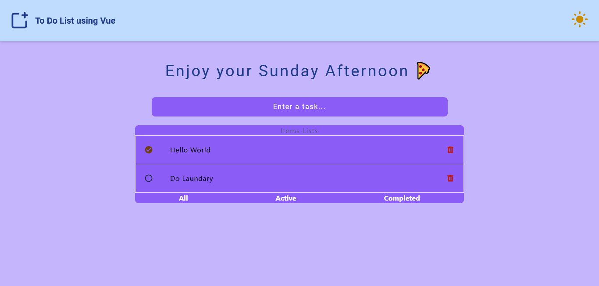

# <h1 align="center">**To Do List Using Vue**</h1>

<code>Vue</code>, <code>Typescript</code>, <code>Tailwind</code>, <code>Vite</code>

  <h3>
    <a href="https://willowy-kitten-900b45.netlify.app/" color="white">
      Live
    </a>
     | 
    <a href="https://github.com/Ezmad-Ze/Todo-List-Vue">
      Solution
    </a>
  </h3>

 
 

## About The Project

Users should be able to:
- View the optimal layout for the app depending on their device's screen size
- See hover states for all interactive elements on the page
- Add new todos to the list
- Mark todos as complete
- Delete todos from the list
- Filter by all/active/complete todos
- Toggle light and dark mode

## Built with

- Semantic HTML5 markup
- Flexbox
- CSS Grid
- Mobile-first workflow
- [Tailwind](https://tailwindcss.com/)
- [Vue](https://vuejs.org/guide/introduction.html) - JS library
- [Typescript](https://www.typescriptlang.org/)

## Useful Rescources

- [Vue Docs](https://vuejs.org/guide/introduction.html)
- [Vue Tutorial](https://www.youtube.com/@LearnVue)

## Author

- Website - [Ezmad_Ze](https://ezmad.pages.dev/)

